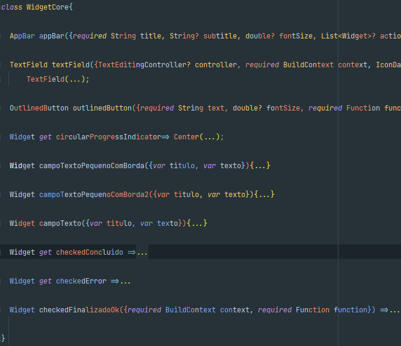

## Add pubspec.yaml

```yaml
    dependencies:
      flutter:
          sdk: flutter
        cupertino_icons: ^1.0.5
      core_aladim_package:
          git:
            url: https://github.com/jacsontiede85/tisa_api_package.git
```

## API: import e usage
```dart
    import 'package:core_aladim_package/core_aladim_package.dart';
    
    class MyClass{
      myFunction() async{
        String sql = "select sysdate from dual";
        var response = await ApiPackage().jwt(urlServer: 'http://localhost:8080/api/', sql: sql);
        //...
      }
    }
```

## WIDGET: import e usage [with WidgetCore]
```dart
    import 'package:core_aladim_package/core_aladim_package.dart';

    //...
    class _MyClassPageState extends State<MyClassPage> with WidgetCore{
      @override
      Widget build(BuildContext context) {
        return Material(
            child: Scaffold(
              appBar: appBar(title: 'Nome do app',),
              //...
            )
        );
      }
    }
```
